<!-- BANNER: generated by scripts/build.py (edit QUERY / EVENTS there, re-run) -->
<picture>
  <source media="(prefers-color-scheme: dark)"  srcset="assets/banner-dark.svg">
  <source media="(prefers-color-scheme: light)" srcset="assets/banner-light.svg">
  
</picture>

 

Hi, I'm **Janyris** (*jah-NEH-ris*), an IT professional in New York moving into **SOC / blue team** work,
with a long-term focus on where **cybersecurity and AI** meet. Right now I'm in cybersecurity
training (AI tools, networking, security operations) and building hands-on blue team labs.

 

&nbsp;
&nbsp;

